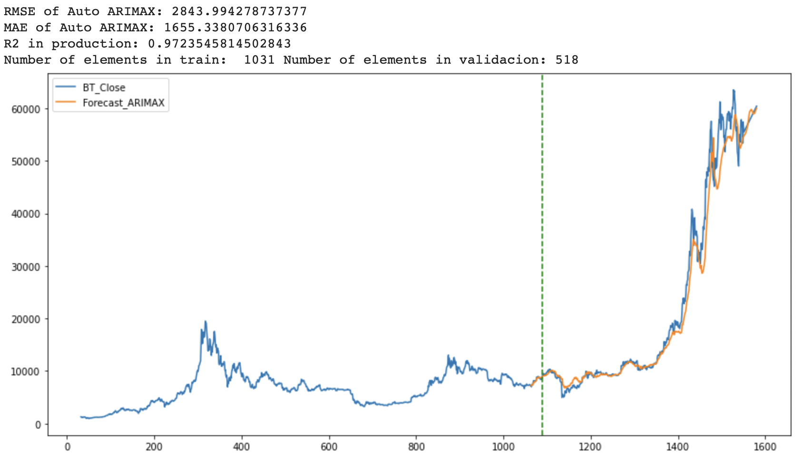
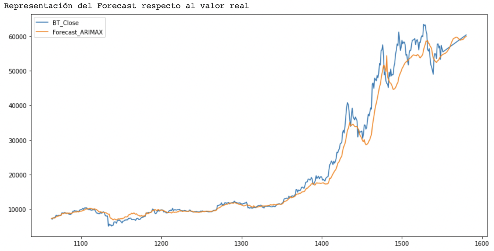
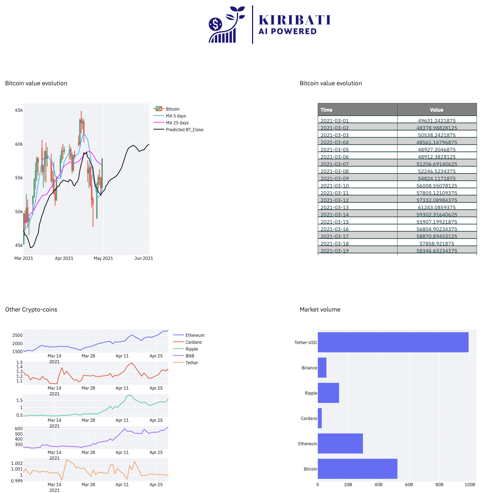

## Equipo KIRIBATI

### Master en Data Analytics para la Empresa

#### Data project 3.

* [Lluis LLoret](https://github.com/luisllll)
* [Marco Colapietro](https://github.com/Marcolapietro)
* [Gonzalo  Alberola](https://github.com/GonzaloAP97)
* [Marta Álvarez](https://github.com/maalal)
* [Borja Ponz](https://github.com/fbponz)

Objetivo del proyecto, ser capaces de predecir el precio del bitcoin en las siguientes ventanas temporales: 1 día, 5 días y 30 días.

#### 2) PoC

Para la resolución del PoC, hemos optado por realizar un notebook donde se puede ejecutar y se puede obtener los datos desde yahoo finance, limpiar los datos, transformarlos y generar una  predicción.

Hemos gastado las siguientes variables, para entrenar el modelo.

El algoritmo que hemos gastado es un ensemble entre FB Prophet y Arima con variables erógenas. Con el algoritmo FB Prophet generamos una predicción de variables erógenas que gastaremos como entrada en el algoritmo ARIMA: Las variables  bitcoin value, bitcoin volume y predicción de standard and poors.

Predicción del valor de cierre  del bitcoin

Predicción del volumen del bitcoin

Predicción del valor de cierre SP500

Aqui podemos observar la representacion de la totalidad de los datos en naranja está representado la predicción. La linea verde determina los datos que han sido gastados para entrrnar(Lado izquierdo) y para validad(Lado derecho).

Aqui podemos observar una captura ampliada de la zona de validación.

Para realizar el dashboard hemos gastado la librería de python llamada Streamlit, el resultado es el mostrado en la siguiente imagen.

La arquitectura que proponemos para llevar esto a producción, es una solución basada en cloud.

#### 2.1) Lanzar el dashboard.

Para ejecutar el notebook, basta con entrar en Google Colab y ejecutar el documento que puede encontrar en la carpeta /models. Ensemble_FB_Prophet_ARIMA(DP3_Final).ipynb
Una vez esta ejecutado nos genera un documento con nombre "data_prediccion_30d.csv" Este fichero debemos guardarlo en la carpeta /data.

En la carpeta /procesado, hay un script con nombre etl_visualization.py con esté script generamos los datos necesarios para realizar una visualización de la web-page

    python etl_visualization.py

En la carpeta /web se encuentra la pagina realizada con la librería streamlit

    $ streamlit run app.py
    
Una vez lanzado el comando, tenemos disponible la web pag en la siguiente dirección

    http://localhost:8501

#### 3) Lineas de mejora

- Incluir nuevas variables de análisis fundamental
- Incluir sentiment análisis de twitter.

## Kiribati Team
